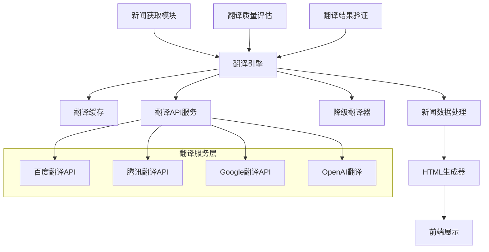
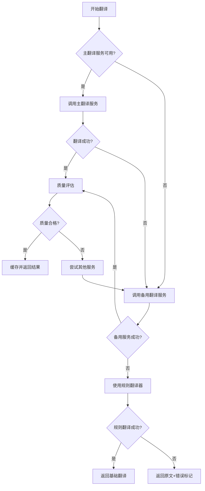

# 新闻翻译增强功能设计文档

## 概述

当前AI新闻推送系统存在翻译质量问题：系统使用硬编码的翻译映射表和通用模板内容，导致用户看到的新闻标题和描述与实际新闻内容不符。本设计旨在实现智能化的新闻翻译系统，提供准确、自然的中文翻译，让用户能够直接理解真实新闻内容。

## 架构设计

### 系统架构图



### 核心组件

#### 1. 智能翻译引擎 (IntelligentTranslator)
- **职责**: 统一管理所有翻译服务，提供智能翻译策略
- **功能**: 
  - 多翻译服务集成和负载均衡
  - 翻译质量评估和优选
  - 缓存管理和性能优化
  - 降级策略和错误处理

#### 2. 翻译服务适配器 (TranslationAdapter)
- **职责**: 封装不同翻译API的调用逻辑
- **支持的服务**:
  - 百度翻译API (主要服务)
  - 腾讯翻译API (备用服务)
  - Google翻译API (国际服务)
  - OpenAI GPT翻译 (高质量服务)

#### 3. 翻译缓存管理器 (TranslationCache)
- **职责**: 管理翻译结果的缓存和持久化
- **功能**:
  - 基于内容哈希的缓存键生成
  - 翻译结果的本地存储
  - 缓存过期和清理策略
  - 缓存命中率统计

#### 4. 翻译质量评估器 (QualityAssessor)
- **职责**: 评估翻译质量并选择最佳结果
- **评估维度**:
  - 语义准确性
  - 中文表达自然度
  - 专业术语准确性
  - 上下文一致性

## 组件和接口设计

### 核心接口定义

```python
class ITranslationService:
    """翻译服务接口"""
    def translate_text(self, text: str, source_lang: str = 'en', target_lang: str = 'zh') -> TranslationResult
    def translate_batch(self, texts: List[str], source_lang: str = 'en', target_lang: str = 'zh') -> List[TranslationResult]
    def get_service_status(self) -> ServiceStatus

class ITranslationCache:
    """翻译缓存接口"""
    def get_translation(self, content_hash: str) -> Optional[CachedTranslation]
    def save_translation(self, content_hash: str, translation: TranslationResult) -> bool
    def clear_expired_cache(self) -> int

class IQualityAssessor:
    """翻译质量评估接口"""
    def assess_translation(self, original: str, translation: str) -> QualityScore
    def compare_translations(self, original: str, translations: List[str]) -> List[QualityScore]
```

### 数据模型

```python
@dataclass
class TranslationResult:
    """翻译结果数据模型"""
    original_text: str
    translated_text: str
    source_language: str
    target_language: str
    service_name: str
    confidence_score: float
    timestamp: datetime
    quality_score: Optional[float] = None

@dataclass
class NewsTranslation:
    """新闻翻译数据模型"""
    news_id: str
    original_title: str
    translated_title: str
    original_description: str
    translated_description: str
    translation_metadata: Dict[str, Any]
    created_at: datetime
    updated_at: datetime

@dataclass
class QualityScore:
    """翻译质量评分"""
    overall_score: float  # 0-1之间的总体评分
    semantic_accuracy: float  # 语义准确性
    fluency: float  # 流畅度
    terminology_accuracy: float  # 术语准确性
    context_consistency: float  # 上下文一致性
```

## 数据模型

### 翻译缓存数据结构

```json
{
  "translation_cache": {
    "content_hash": "md5_hash_of_original_content",
    "original_text": "Original English text",
    "translated_text": "翻译后的中文文本",
    "source_language": "en",
    "target_language": "zh",
    "service_used": "baidu_translate",
    "quality_score": 0.95,
    "created_at": "2025-07-24T12:00:00Z",
    "expires_at": "2025-08-24T12:00:00Z",
    "usage_count": 1
  }
}
```

### 增强的新闻数据结构

```json
{
  "news_item": {
    "id": "unique_news_id",
    "original_title": "Original English Title",
    "translated_title": "翻译后的中文标题",
    "original_description": "Original English description",
    "translated_description": "翻译后的中文描述",
    "translation_metadata": {
      "title_translation": {
        "service": "baidu_translate",
        "confidence": 0.95,
        "quality_score": 0.92,
        "alternatives": ["备选翻译1", "备选翻译2"]
      },
      "description_translation": {
        "service": "baidu_translate", 
        "confidence": 0.88,
        "quality_score": 0.85,
        "alternatives": []
      }
    },
    "url": "original_news_url",
    "source": "news_source",
    "publishedAt": "2025-07-24T10:00:00Z",
    "category": {...},
    "importance": 3
  }
}
```

## 错误处理策略

### 翻译服务降级策略

1. **主服务失败**: 百度翻译API → 腾讯翻译API
2. **备用服务失败**: 腾讯翻译API → Google翻译API  
3. **所有API失败**: 使用本地规则翻译器
4. **完全失败**: 显示原文 + 错误提示

### 错误处理流程



## 测试策略

### 单元测试覆盖

1. **翻译服务测试**
   - API调用成功/失败场景
   - 不同语言对的翻译测试
   - 批量翻译功能测试
   - 服务状态检查测试

2. **缓存管理测试**
   - 缓存存储和检索
   - 缓存过期处理
   - 缓存清理功能
   - 并发访问安全性

3. **质量评估测试**
   - 翻译质量评分算法
   - 多翻译结果比较
   - 边界条件处理

### 集成测试场景

1. **端到端翻译流程**
   - 新闻获取 → 翻译 → 缓存 → 展示
   - 多服务降级流程测试
   - 大批量新闻处理测试

2. **性能测试**
   - 翻译响应时间测试
   - 并发翻译处理能力
   - 缓存命中率优化

3. **错误恢复测试**
   - 网络中断恢复
   - API限流处理
   - 服务异常恢复

### 翻译质量验证

1. **自动化质量检查**
   - 关键术语翻译准确性
   - 数字、日期、专有名词保持
   - 中文表达自然度评估

2. **人工质量抽检**
   - 每日随机抽取10%翻译结果
   - 专业术语翻译准确性检查
   - 用户反馈收集和分析

## 性能优化

### 缓存策略

1. **多级缓存架构**
   - L1: 内存缓存 (最近1小时的翻译)
   - L2: 本地文件缓存 (最近7天的翻译)
   - L3: 数据库缓存 (历史翻译记录)

2. **缓存键设计**
   ```python
   cache_key = f"trans_{md5(original_text)}_{source_lang}_{target_lang}"
   ```

3. **缓存更新策略**
   - 翻译质量提升时更新缓存
   - 定期清理低质量翻译缓存
   - 用户反馈驱动的缓存更新

### 批量处理优化

1. **批量翻译API调用**
   - 将多个短文本合并为单次API调用
   - 智能文本分割避免超长内容
   - 并行处理多个翻译请求

2. **异步处理架构**
   - 新闻获取和翻译异步解耦
   - 翻译任务队列管理
   - 结果异步回调处理

## 安全考虑

### API密钥管理

1. **密钥轮换策略**
   - 定期更换翻译服务API密钥
   - 多个密钥负载均衡使用
   - 密钥泄露时的快速响应

2. **访问控制**
   - API调用频率限制
   - 异常访问模式检测
   - 服务降级保护机制

### 数据隐私保护

1. **敏感信息处理**
   - 翻译前敏感信息脱敏
   - 翻译日志定期清理
   - 用户数据最小化原则

2. **合规性考虑**
   - 遵循数据保护法规
   - 翻译服务提供商合规性审查
   - 数据跨境传输合规处理