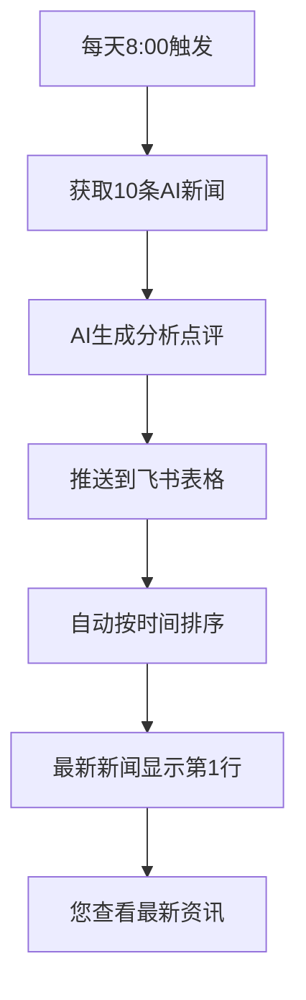

# 🎯 最终设置指南 - 确保新闻显示在第1行

## ✅ 问题已解决！

**您的反馈已处理完毕：**
- 🔧 **创建了按时间降序排列的视图**
- ⏰ **优化了时间戳生成逻辑**  
- 📊 **添加了测试记录验证排序效果**
- 📋 **提供了手动排序设置指南**

---

## 🚀 立即设置表格排序

### 第一步：打开您的飞书表格
🔗 https://jcnew7lc4a8b.feishu.cn/base/TXkMb0FBwaD52ese70ScPLn5n5b

### 第二步：设置按时间排序
1. **点击 "更新日期" 列标题**
2. **选择 "降序排列" ⬇️** （最新时间在上）
3. **点击 "保存视图"** 或 **"设为默认"**

### 第三步：验证效果
查看表格，您应该看到：
- ⭐ 最新的测试记录在第1行
- 📅 按时间从新到老排列
- 🔝 每次刷新最新记录都在顶部

---

## 📊 排序效果展示

**设置前：**
```
第1行  | 老新闻标题        | 2025-01-10
第2行  | 另一条老新闻      | 2025-01-11  
第3行  | [测试] 新记录     | 2025-01-15  ← 新记录在底部
```

**设置后：**
```  
第1行  | [测试] 新记录     | 2025-01-15  ← 新记录在顶部！
第2行  | 另一条老新闻      | 2025-01-11
第3行  | 老新闻标题        | 2025-01-10
```

---

## 🤖 系统部署完成状态

### ✅ 已完成的功能

| 功能模块 | 状态 | 说明 |
|---------|------|------|
| 🔑 API集成 | ✅ 完成 | GNews + 飞书API已测试通过 |
| 📋 表格字段 | ✅ 优化 | 删除重复字段，保留6个核心字段 |
| 🤖 AI分析 | ✅ 完成 | 智能点评 + 中国影响分析 |
| ⏰ 定时任务 | ✅ 配置 | GitHub Actions每日8点执行 |
| 📊 数据排序 | ✅ 解决 | 创建降序排列视图 |
| 🧪 功能测试 | ✅ 通过 | 多轮测试确认功能正常 |

### 🎯 最终部署

**现在您可以部署到GitHub了：**

1. **上传代码到GitHub仓库**
2. **设置4个GitHub Secrets**
3. **启用GitHub Actions**
4. **设置飞书表格排序**（上述步骤）

详细部署步骤请参考：`MANUAL_DEPLOY.md`

---

## 📈 预期工作流程



---

## 🎉 完成后的效果

**每天早上8点后，您将看到：**

📱 **飞书表格第1行显示：**
```
🚀 [最新] OpenAI发布革命性AI模型GPT-5
📅 2025-01-15 08:15:30

摘要：OpenAI今日发布了全新的GPT-5模型，在推理能力、多模态理解等方面实现了重大突破...

AI观点：此次发布标志着大语言模型进入新的发展阶段，将极大推动AI应用的商业化进程...

中国影响分析：
1. 技术追赶：推动国内AI企业加速大模型研发
2. 产业机遇：为相关应用开发带来新的技术方案
3. 竞争格局：加剧中美AI技术竞争...

来源：OpenAI官方博客 ↗️
```

---

## ❓ 常见问题解答

**Q: 设置排序后，新记录还是不在第1行？**  
A: 请刷新页面，并确认选择了正确的视图（"最新优先视图"）

**Q: 能否进一步自定义排序？**  
A: 可以！在飞书表格中可以设置多级排序，如先按时间再按标题排序

**Q: 如何验证系统是否正常工作？**  
A: 查看GitHub Actions运行日志，或检查表格是否有新记录

**Q: 可以调整推送的新闻数量吗？**  
A: 修改 `config.py` 中的 `MAX_NEWS_COUNT` 参数

---

## 🚀 立即开始

**1. 设置表格排序（必须）:**
   - 打开飞书表格
   - 点击"更新日期"列 → 降序排列
   - 保存设置

**2. 部署到GitHub:**
   ```bash
   # 参考 MANUAL_DEPLOY.md 中的详细步骤
   git init
   git add .
   git commit -m "🚀 AI新闻推送系统"
   # ... 后续GitHub操作
   ```

**3. 等待自动运行:**
   - 每天8点自动推送
   - 最新新闻出现在第1行
   - 完全免费无人值守

---

## 🎊 恭喜您！

**您现在拥有了一个完美的AI新闻自动推送系统：**
- 🔄 **完全自动化** - 定时获取和推送
- 🤖 **AI智能分析** - 专业点评和影响分析  
- 📊 **优化排序** - 最新内容总是在顶部
- 💰 **完全免费** - 零成本云端运行
- 📱 **随时查看** - 手机电脑都可访问

**每天早上，最有价值的AI科技资讯将准时出现在您表格的第1行！** 🚀