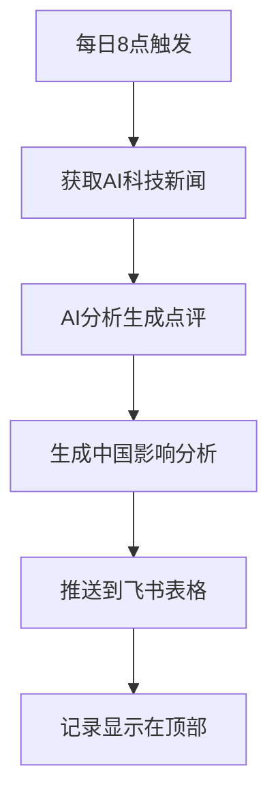

# 🚀 AI新闻推送系统 - 快速开始

## ✅ 系统已完全配置完成！

**您的AI新闻自动推送系统已经准备就绪，包含：**

- 🔑 **API配置完成** - GNews API + 飞书API已集成
- 📋 **表格字段优化** - 已删除重复字段，保留6个核心字段
- 🤖 **AI分析模块** - 智能生成点评和中国影响分析
- ⏰ **定时任务** - 每日北京时间8点自动执行
- 📊 **测试验证** - 已成功推送测试记录到您的表格

## 🎯 一键部署到GitHub

运行以下命令即可完成GitHub自动部署：

```bash
python3 deploy_to_github.py
```

**这个脚本会自动：**
1. 📁 初始化Git仓库并提交代码
2. 🌐 创建GitHub仓库并推送代码
3. 🔐 自动设置所有API密钥到GitHub Secrets
4. ⚙️ 启用GitHub Actions自动化工作流

## 📋 当前表格字段

您的飞书多维表格现在包含6个精简字段：

| 字段名 | 类型 | 说明 |
|--------|------|------|
| 标题 | 文本 | 新闻标题 |
| 摘要 | 文本 | 新闻摘要内容 |
| AI观点 | 文本 | AI生成的专业点评 |
| 中国影响分析 | 文本 | 对中国行业影响的详细分析 |
| 更新日期 | 日期时间 | 新闻发布时间 |
| 来源 | URL链接 | 新闻来源链接（可点击） |

## 🔄 确保最新记录在顶部

为了让最新新闻显示在表格最上方，请在飞书表格中：

1. **点击 "更新日期" 列标题**
2. **选择 "降序排列"** （最新时间在上）
3. **设置为默认排序**

这样每天推送的新新闻都会自动出现在最上方！

## 📈 系统工作流程



## 🎉 完成后效果

**每天您将收到包含以下内容的新闻：**

- 📰 **10条最新AI科技新闻**
- 🔍 **智能筛选** - 聚焦AI、机器学习、ChatGPT等关键词
- 🤖 **专业点评** - AI生成的技术分析和观点
- 🇨🇳 **中国视角** - 对国内行业影响的深度分析
- 🔗 **原文链接** - 可直接跳转查看完整新闻
- ⏰ **准时推送** - 每天8点准时更新

## 🔗 重要链接

- **📊 您的飞书表格**: https://jcnew7lc4a8b.feishu.cn/base/TXkMb0FBwaD52ese70ScPLn5n5b
- **⚙️ GitHub Actions** (部署后): https://github.com/你的用户名/ai-news-pusher/actions
- **📖 详细部署说明**: DEPLOYMENT.md

## ❓ 常见问题

**Q: 部署需要费用吗？**  
A: 完全免费！使用GitHub Actions的免费额度。

**Q: 可以修改推送时间吗？**  
A: 可以！编辑`.github/workflows/daily-news-push.yml`中的cron表达式。

**Q: 如何调整新闻数量？**  
A: 修改`config.py`中的`MAX_NEWS_COUNT`参数。

**Q: 新闻没有按时间倒序？**  
A: 在飞书表格中设置"更新日期"列为降序排列。

---

## 🚀 立即开始

**现在运行部署命令：**

```bash
python3 deploy_to_github.py
```

**部署完成后，您就拥有了一个完全自动化的AI新闻推送系统！** 🎯